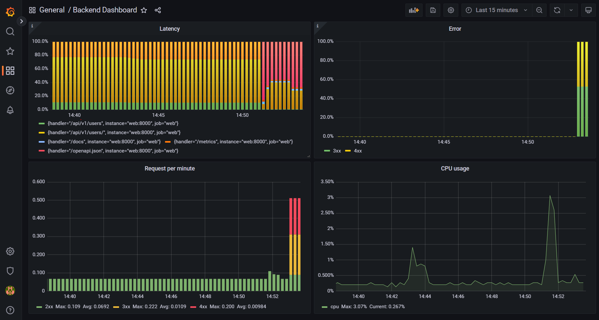

Развернут prometheus и grafana в docker-compose

```dockerfile
  prometheus:
    image: prom/prometheus:v2.43.0
    container_name: prometheus
    restart: unless-stopped
    volumes:
      - ./prometheus.yml:/etc/prometheus/prometheus.yml
    command:
      - '--config.file=/etc/prometheus/prometheus.yml'
    expose:
      - 9090
    ports:
      - 9090:9090
    depends_on:
      - web

  grafana:
    image: grafana/grafana:9.2.15
    container_name: grafana
    expose:
      - 3000
    ports:
      - 3000:3000
    depends_on:
      - prometheus
    env_file:
      - ./grafana/config.monitoring
    volumes:
      - ./grafana/provisioning:/etc/grafana/provisioning
```

### Метрики

Сбор метрик с помощью prometheus-fastapi-instrumentator, как на семинаре.

### Dashboard

Создан дашбоард с 4 золотыми сигналами: latency, error, traffic (requests per min), saturation (cpu usage),



Latency: ```"http_request_duration_seconds_sum{job=\"web\", handler!=\"none\"} / http_request_duration_seconds_count",```

Error: ```"sum by (status) (rate(http_requests_total{status!=\"2xx\"}[1m]))",```

Traffic: ```"sum by (status) (rate(http_requests_total[1m]))",```

CPU usage: ```"rate(process_cpu_seconds_total{job=\"web\"}[30s])"```