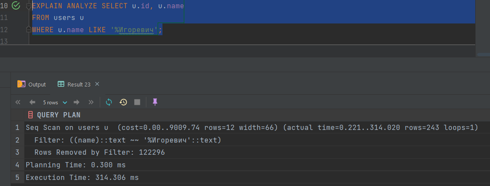
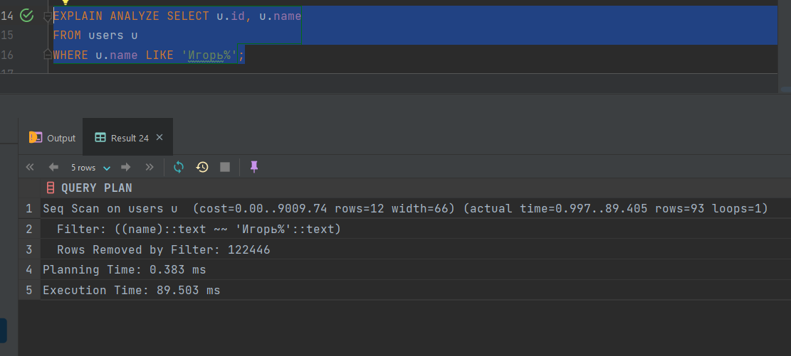
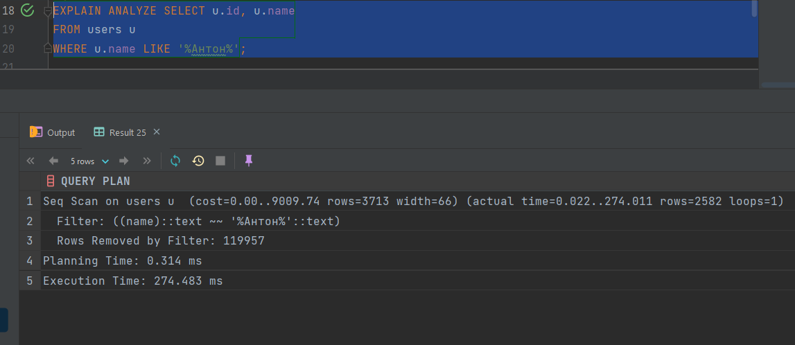
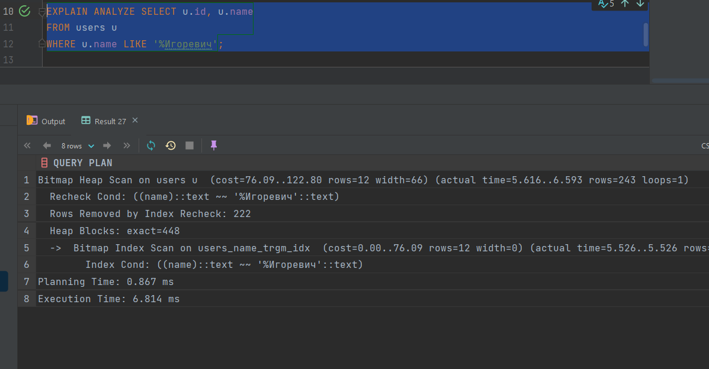
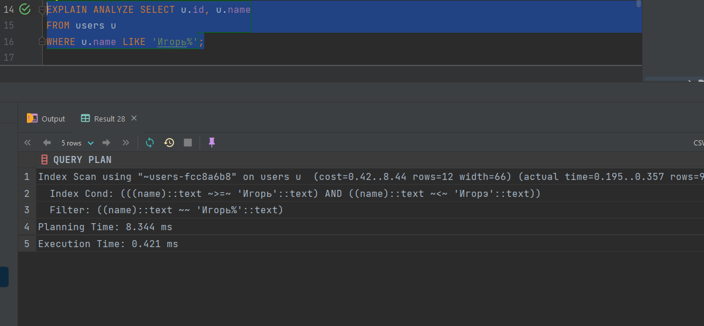
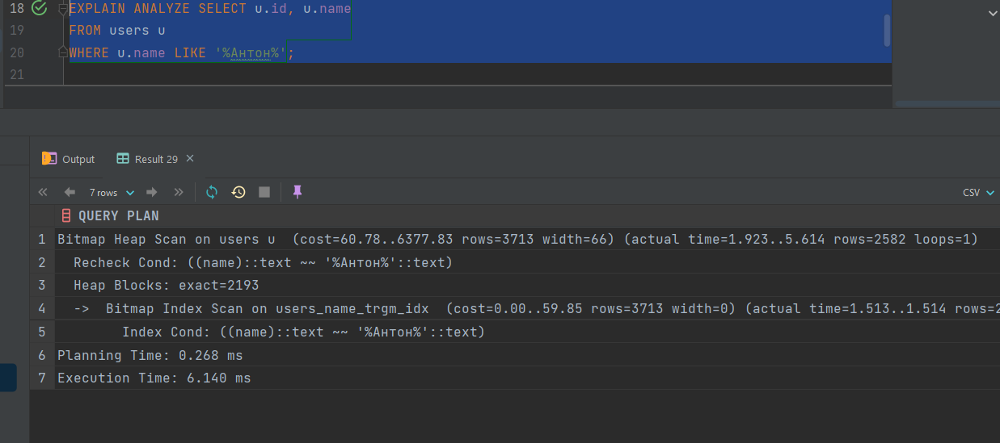
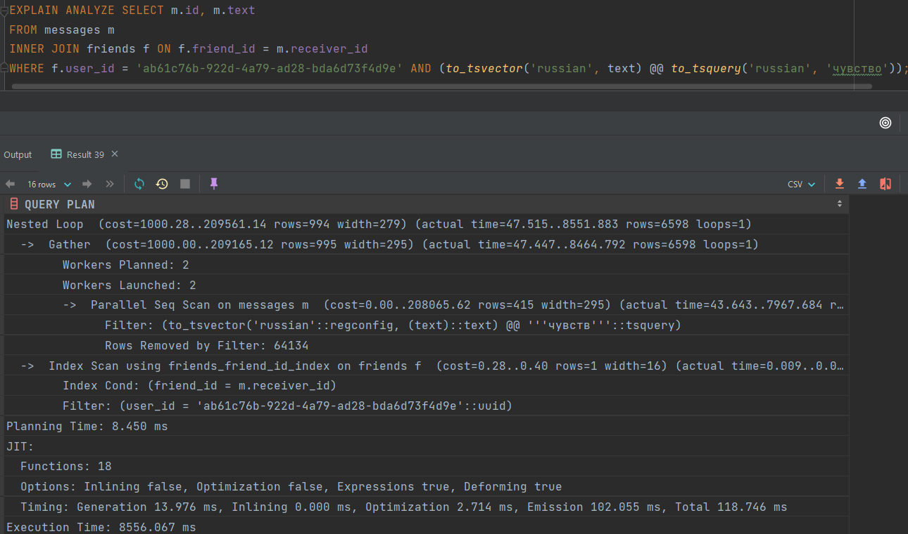
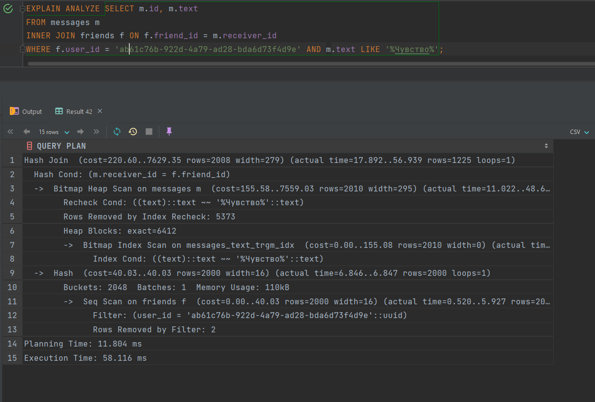
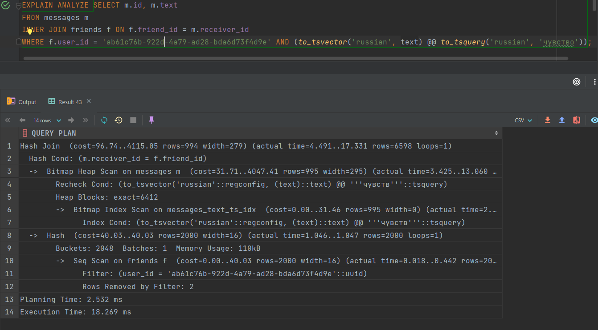

# Поиск по ФИО 

### Без индексов







### С индексами

С помощью инструмента из первой домашки по индексам и по примеру семинара добавил индексы:
```sql
CREATE INDEX "~users-fcc8a6b8"
  ON users((name::text) text_pattern_ops, id);
CREATE INDEX users_name_trgm_idx ON users USING GIN (name gin_trgm_ops);
```








# Поиск по сообщениям у друзей пользователя

### Без индексов


Полнотекстовый



### С индексами

По документации постгреса добавил индекс для полнотекстового поиска + решил попробовать добавить gin_trgm_ops

```sql
CREATE INDEX messages_text_trgm_idx ON messages USING GIN (text gin_trgm_ops);
CREATE INDEX messages_text_ts_idx ON messages USING GIN (to_tsvector('russian', text));
```






## Выводы

Используя встроенные инструменты и расширения Postgres кажется вполне можно добиться приемлимых результатов для поиска по небольшому объему текстовой информации, в иных случаях лучше использовать специализированные инструменты, например Elasticsearch.