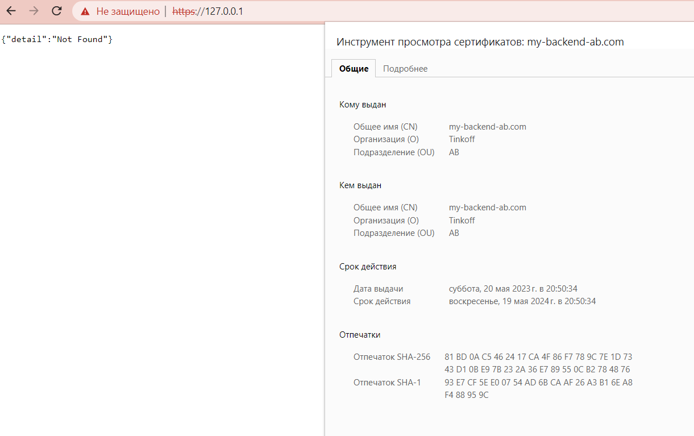
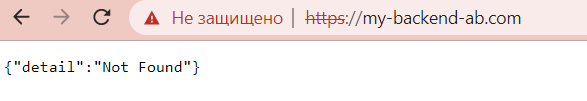
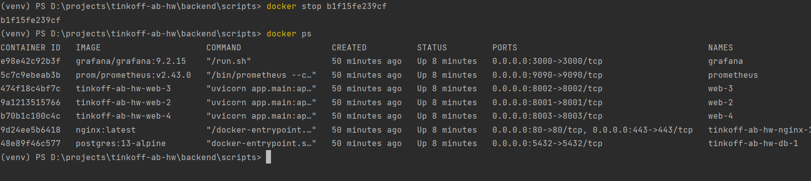
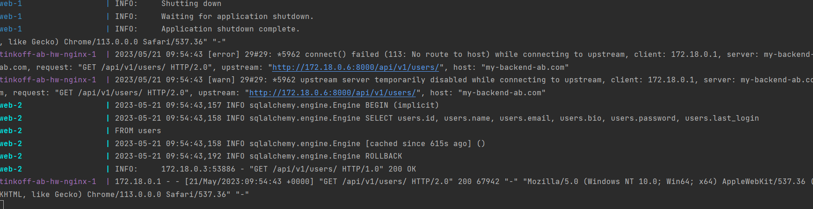
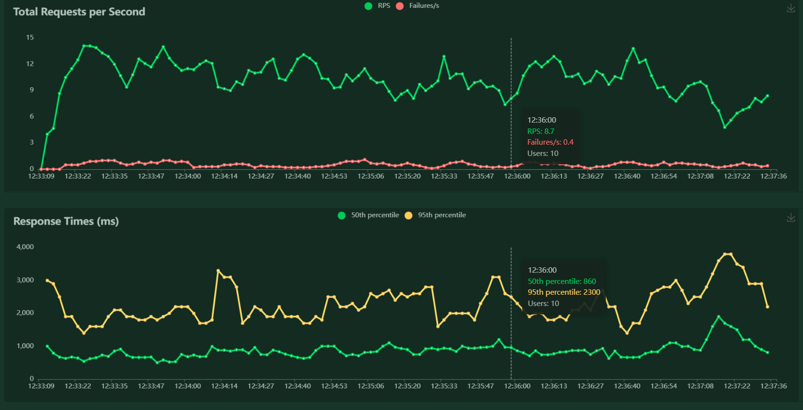
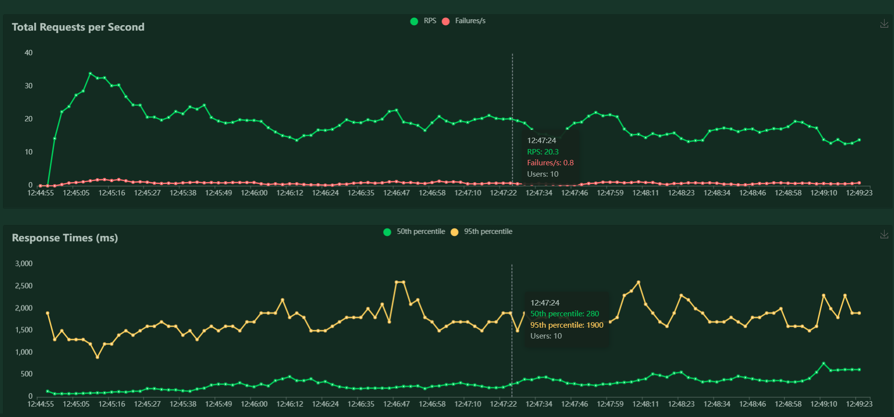

### 1) Конфигурация балансировщика

По примеру с семинара сконфигурировал так:

```conf
upstream backend-lb {
    least_conn;
    server web-1:8000;
    server web-2:8001;
    server web-3:8002;
    server web-4:8003 backup;
}

server {
    listen              443 ssl http2;
    server_name         my-backend-ab.com www.my-backend-ab.com;
    ssl_certificate     /etc/nginx/conf/cert.pem;
    ssl_certificate_key /etc/nginx/conf/key.pem;
    ssl_protocols       TLSv1 TLSv1.1 TLSv1.2 TLSv1.3;
    ssl_ciphers         HIGH:!aNULL:!MD5;

    location / {
        proxy_read_timeout 5s;
        proxy_pass http://backend-lb;
    }
}

server {
    listen 80;

    server_name my-backend-ab.com www.my-backend-ab.com;

    return 302 https://$server_name$request_uri;
}
```

### 2) В docker-compose добавил инстансы web-2, web-3, web-4 соответственно

### 3) Демонстрация домена, https, http2 – скриншоты из браузера



### 4) Демонстрация и описание отключения одного инстанса, видим что сервис жив и работает

Стопаю web-1 и делаю GET запрос



После таймаута, отвечает web-2


### 5) Нагрузочный скрипт и скриншоты До/После использования балансировщика

```python
import random

from locust import HttpUser, task


class BackendUser(HttpUser):
    users_passwords = {}
    users_access_tokens = {}

    @task(3)
    def get_users(self):
        self.client.get("api/v1/users/", verify=False)

    @task
    def login(self):
        if len(self.users_passwords) == 0:
            return
        user_id = random.choice(list(self.users_passwords.keys()))
        data = self.client.post(
            "api/v1/login",
            params={
                "id_": user_id,
                "password": self.users_passwords[user_id],
            },
            verify=False
        )
        access_token = data.json()["data"]["access_token"]
        self.users_access_tokens[user_id] = access_token

    @task(3)
    def get_user(self):
        if len(self.users_passwords) == 0:
            return
        user_id = random.choice(list(self.users_passwords.keys()))
        self.client.get(f"api/v1/users/{user_id}", verify=False)

    @task
    def create_user(self):
        u = self.client.post(
            "api/v1/users",
            params={
                "name": "test",
                "email": "test@example.com",
                "bio": "test",
                "password": "test",
            },
            verify=False
        )
        self.users_passwords[u.json()["id"]] = "test"

    @task
    def update_user(self):
        if len(self.users_passwords) == 0:
            return
        user_id = random.choice(list(self.users_passwords.keys()))
        self.client.put(
            f"api/v1/users/{user_id}",
            params={
                "name": "test",
                "email": "newtest@example.com",
                "bio": "test",
                "password": "test",
            },
            verify=False
        )

    @task
    def create_friend(self):
        if len(self.users_passwords) <= 1:
            return
        # pick up a pair of users randomly
        user_id = random.choice(list(self.users_access_tokens.keys()))
        new_id = random.choice(list(self.users_passwords.keys()))
        while user_id == new_id:
            new_id = random.choice(list(self.users_passwords.keys()))
        self.client.post(
            f"api/v1/friends",
            params={
                "user_id": user_id,
                "friend_id": new_id,
            },
            headers={
                "Authorization": f"Bearer {self.users_access_tokens[user_id]}",
            },
            verify=False
        )

    @task(2)
    def get_friends(self):
        if len(self.users_passwords) == 0:
            return
        user_id = random.choice(list(self.users_access_tokens.keys()))
        self.client.get(
            f"api/v1/friends/{user_id}",
            headers={
                "Authorization": f"Bearer {self.users_access_tokens[user_id]}",
            },
            verify=False
        )

```





